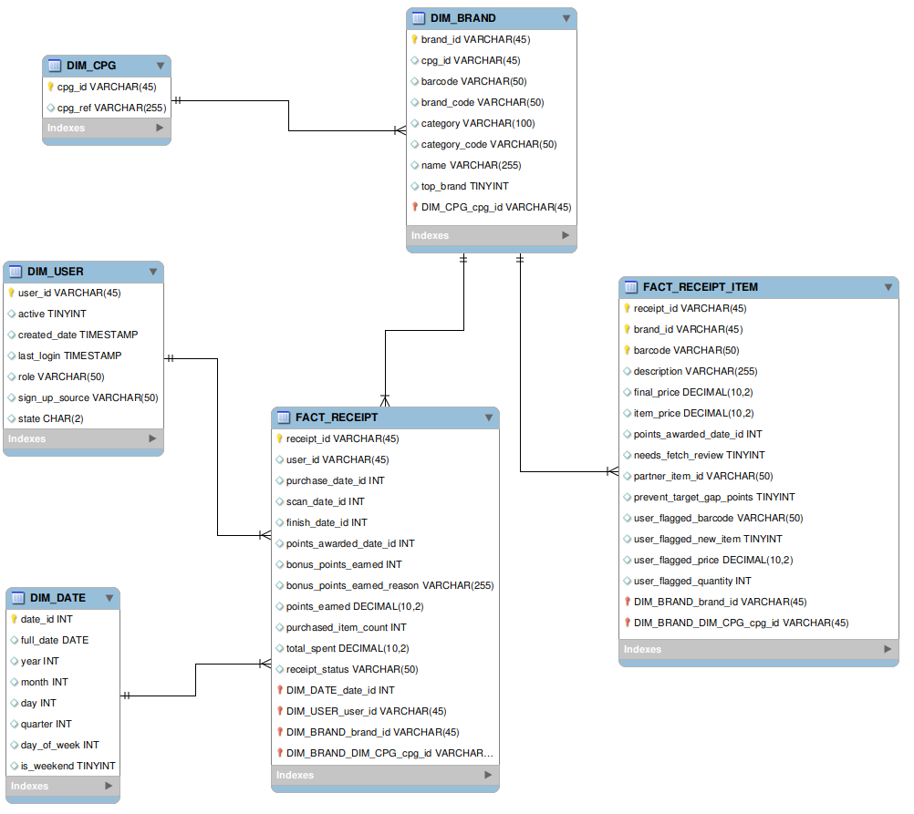

# Description
Data Engineer: Jah-Wilson Teeba

Fetch Rewards Coding Exercise - Analytics Engineer - Created Dimensional data model from unstructured JSON using Amazon Redshift as the data warehouse. Developed a data quality script to validate the data and identify inconsistencies.

Tech Stack:
- Python: used for data quality checks
- Pytest - used for testing Python code
- MySQL Workbench - used for creating visual data model
- SQL (Redshift): used to create data model
- Lucichart - used to create a visual representation of the data warehouse

Data Model - ***Foreign key references are included, for query planning and are not enforced in Redshift***

# Stakeholders Communication

Hi Team,

Here are my findings after conducting a deep dive into the users dataset. To ensure optimal query performance in Redshift, it's important to implement proper distribution and sort keys. Using columnar storage and compression can significantly reduce I/O and improve query speed, while partitioning strategies are essential for managing large tables efficiently. Setting up workload management (WLM) in Redshift helps handle query concurrency and resource allocation effectively. For frequently accessed aggregated data, materialized views can be highly beneficial. Additionally, a data lifecycle management strategy, possibly utilizing Redshift Spectrum for historical data, should be established. Auto-scaling policies can help manage increased loads, and regular analysis and vacuuming of tables are necessary to maintain performance. Proper indexing strategies and caching solutions for frequently accessed data should also be considered. A robust monitoring system should be implemented to track query performance, resource utilization, and data growth, allowing for proactive performance management and informed scaling decisions. These measures will ensure the data model remains accurate, reliable, performant, and scalable in a production environment. Regular reviews and optimizations based on usage patterns are crucial to sustaining system effectiveness.

**Questions about the data:**
- What is the expected volume of data for each table (users, brands, receipts, items)?
- How frequently is new data added or updated?
- Are there any seasonal patterns in the data, especially for receipts?
- What's the distribution of users across different states?
- How many unique CPGs and brands are there?
- What's the average number of items per receipt?
- Are there any specific business rules or constraints that need to be considered?

**Data quality issues discovery:**

Identify data quality issues by checking for null values, duplicates, and inconsistencies. A `Python` data validation script was created to thoroughly analyze the data and uncover any quality concerns.

**Resolving the data quality issues:**

In order to resolve the data quality issues please provide these information needed to resolve data the quality issues:

- Clear definitions of business rules and data constraints
- Expected data formats and valid value ranges for each field
- Information about the source systems and any known issues or limitations
- Historical context about any changes in data collection or business processes
- Access to subject matter experts who can clarify ambiguities or unexpected patterns in the data

**Information need to optimize the data assets:**

Please provide the following information for optimizing the data assets

- Detailed information about the most common query patterns and use cases
- Performance requirements (e.g., expected query response times)
- Data retention policies
- Any plans for future expansion or additional data sources
- Information about the downstream systems or applications that will consume this data
- Budget constraints for infrastructure and tools (e.g.: AWS Redshift)

Challenges include query performance degradation as data volume increases, longer load times for large data ingestions, concurrency issues with multiple users, storage capacity constraints, and greater complexity in maintaining data consistency across expanding datasets. To support this, I have arranged a weekly sync call for further discussion and feedback on these implementations. Please see the attached artifacts for additional details. Thank you.
